# 🛒 E-Commerce Backend API

Backend API cho hệ thống thương mại điện tử, xây dựng bằng ASP.NET Core 8.0. Hỗ trợ quản lý sản phẩm, người dùng, đơn hàng, cùng với một số tính năng nâng cao như gợi ý sản phẩm bằng học máy (TF-IDF), sinh dữ liệu giả và cache bằng Redis.

---

## 🚀 Công nghệ sử dụng

| Công nghệ                             | Mục đích sử dụng cụ thể trong dự án                                    |
|--------------------------------------|------------------------------------------------------------------------|
| **ASP.NET Core 8.0**                 | Xây dựng toàn bộ hệ thống backend và API REST                         |
| **Entity Framework Core (EF Core)**  | Giao tiếp với database SQL Server cho các bảng sản phẩm, đơn hàng, v.v |
| Microsoft.ML, MathNet.Numerics | Triển khai thuật toán TF-IDF để chuyển tên sản phẩm thành vector, sau đó dùng Cosine Similarity để tính độ tương đồng và gợi ý các sản phẩm liên quan || **Bogus**                            | Tạo dữ liệu sản phẩm, người dùng, đơn hàng mẫu để phát triển và test  |
| **Swashbuckle.AspNetCore (Swagger)** | Tạo giao diện và tài liệu cho API giúp dễ dàng kiểm thử                |
| **VnPay**                             | Tích hợp cổng thanh toán trực tuyến: tạo URL thanh toán, nhận phản hồi và xử lý giao dịch |


---

## 📌 Tính năngchính

- ✅ CRUD sản phẩm, đơn hàng, người dùng
- ✅ API đăng ký, đăng nhập (cơ bản)
- ✅ Tích hợp Swagger UI để test API
- ✅ Gợi ý sản phẩm tương đồng bằng TF-IDF (ML.NET) + Cosine Similarity
- ✅ Dữ liệu mẫu sinh tự động với thư viện Bogus

---

## 🧠 Học máy (Gợi ý sản phẩm)

Hiện thực lại thuật toán TF-IDF và Cosine Similarity để gợi ý sản phẩm tương tự dựa trên tên.

> Ví dụ: Nhập sản phẩm A → trả về 5 sản phẩm có tên tương tự nhất.

---

## 🔧 Cài đặt & chạy dự án

### 1️⃣ Clone source
```bash
git clone https://github.com/ten-ban/e-commerce-backend.git
cd e-commerce-backend
```

### 2️⃣ Cấu hình database
```bash
Chỉnh chuỗi kết nối trong appsettings.json (SQL Server)
```

### 3️⃣ Chạy project
```bash
dotnet run
```


# 🛒 E-Commerce Frontend

| Công nghệ             | Mô tả                                                                 |
|-----------------------|----------------------------------------------------------------------|
| **Bootstrap 5**       | Framework CSS giúp thiết kế UI responsive                            |
| **jQuery**            | Thư viện JavaScript hỗ trợ thao tác DOM nhanh chóng                  |
| **Razor Tag Helpers** | Sử dụng các thẻ như `asp-controller`, `asp-action` để routing động   |
| **Layout File**       | Dùng `_Layout.cshtml` làm giao diện khung chính                      |
| **Static Files**      | Các file như `site.css`, `site.js` phục vụ tuỳ biến UI/logic frontend|
| **Chart.js**          | Thư viện hiển thị biểu đồ (line, bar, pie...) phục vụ thống kê      |
| **DataTables**        | Plugin jQuery giúp hiển thị bảng dữ liệu động, có phân trang, filter |


<p align="center">
  
  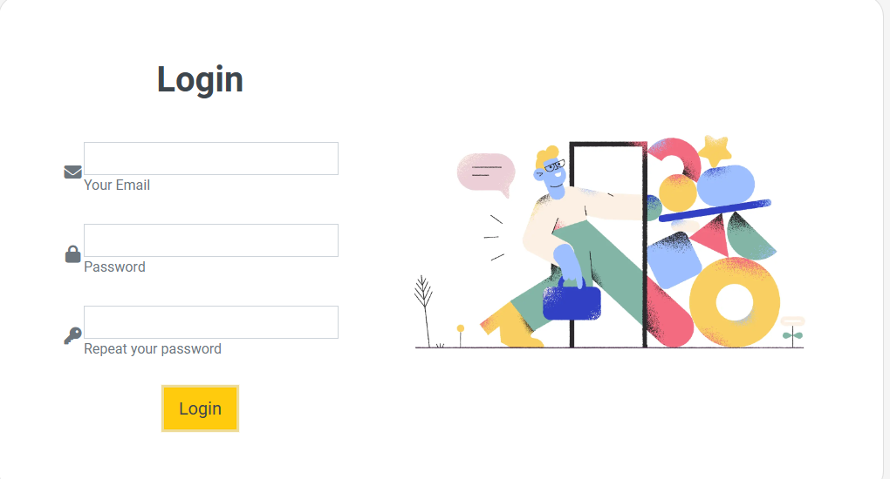

  <br>
  <em>Giao diện Đăng kí, Đăng nhập hệ thống</em>
  <br></br>
</p>

<p align="center">
  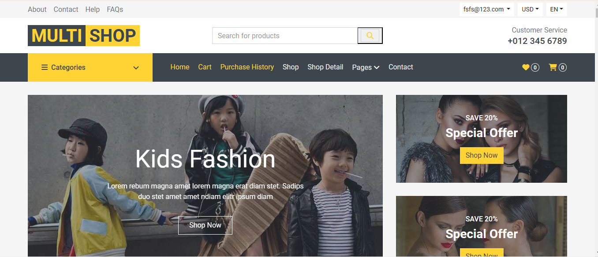
  <br>
  <em> Giao diện trang chủ </em>
    <br></br>

</p>

<p align="center">
  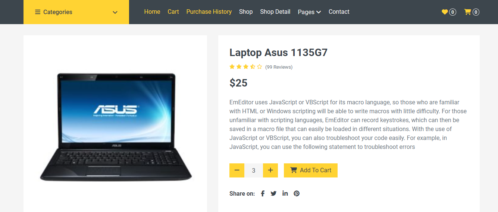
  <br>
  <em>Chi tiết sản phẩm</em>
    <br></br>
</p>

<p align="center">
    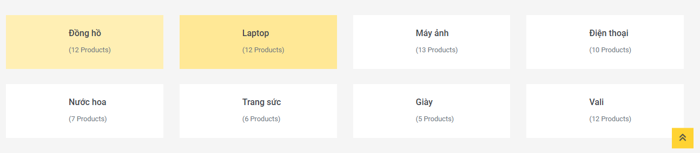
  
  <br>
  <em>Danh sách danh mục và sản phẩm</em>
    <br></br>
</p>

<p align="center">
    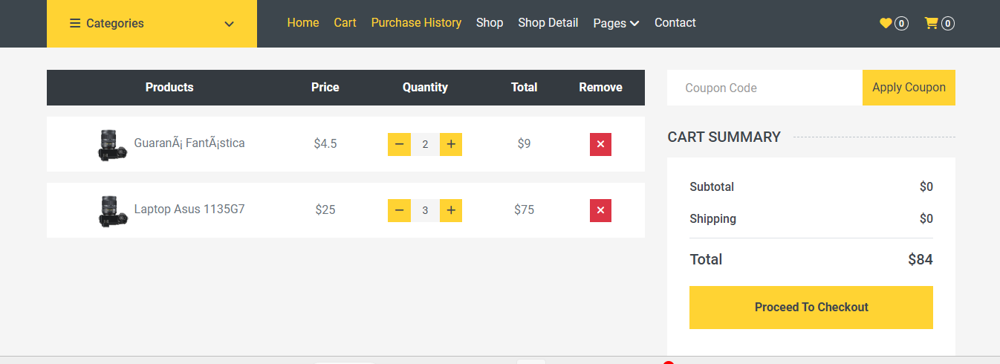
  <br>
  <em>Trang đặt hàng</em>
    <br></br>
</p>

<p align="center">
    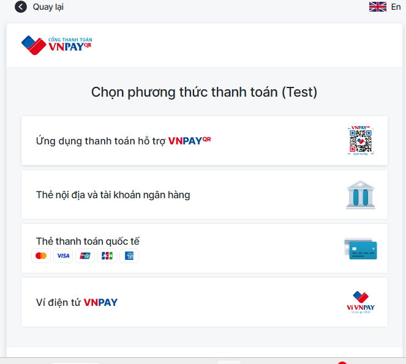
      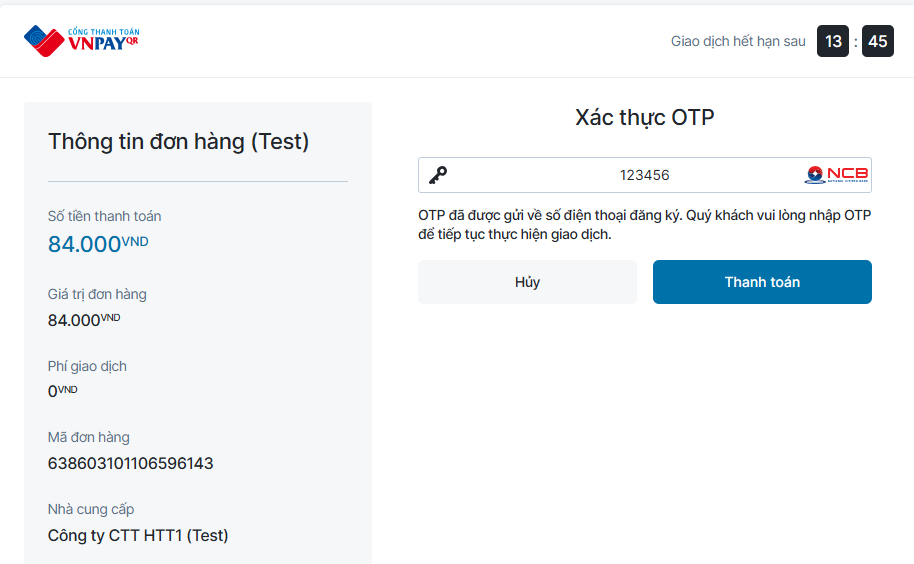
  <br>
  <em>Giao diện thanh toán VnPay</em>
    <br></br>
</p>

<p align="center">
    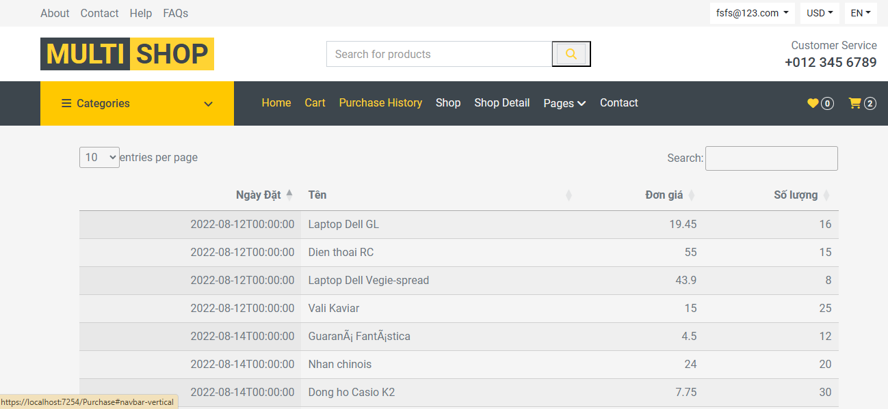
      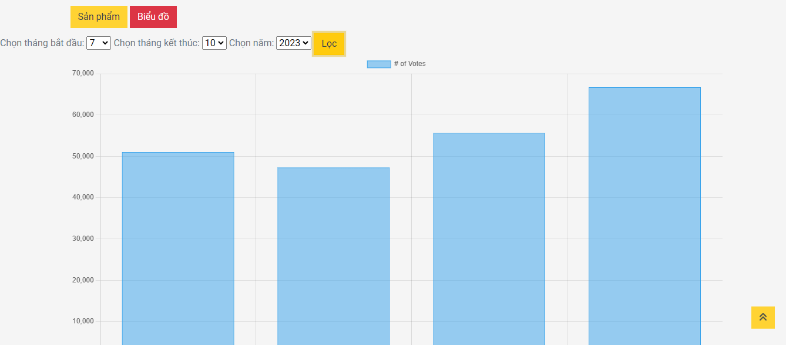
        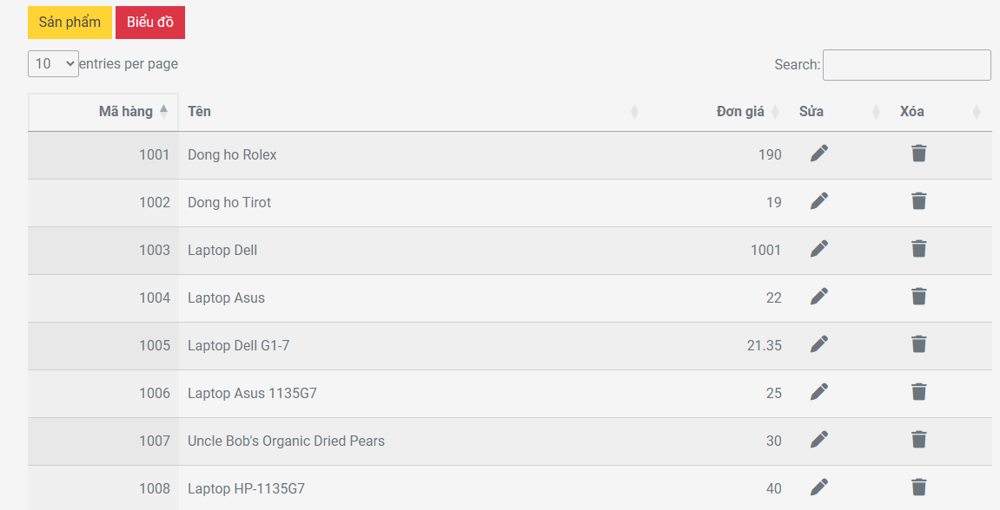

  <br>
  <em>Giao diện quản lí của Admin</em>
    <br></br>
</p>

<p align="center">
    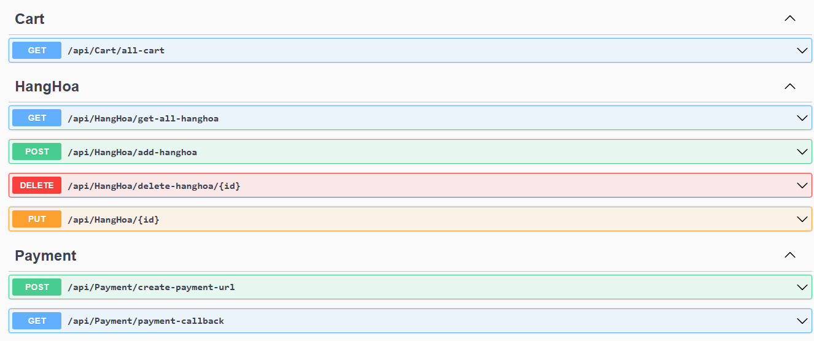
      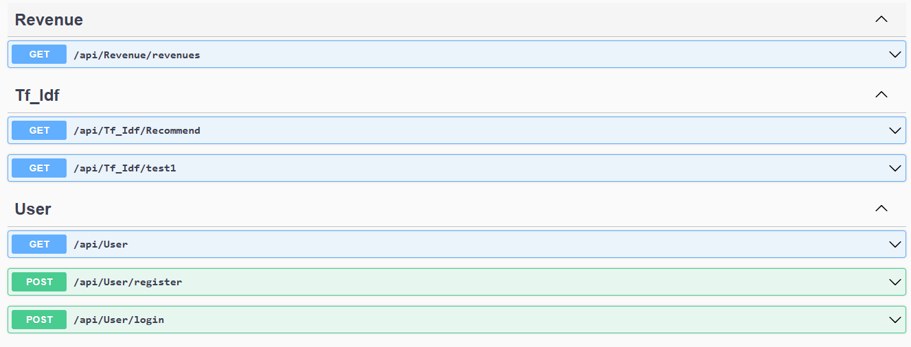

  <br>
  <em>Swagger</em>
    <br></br>
</p>
