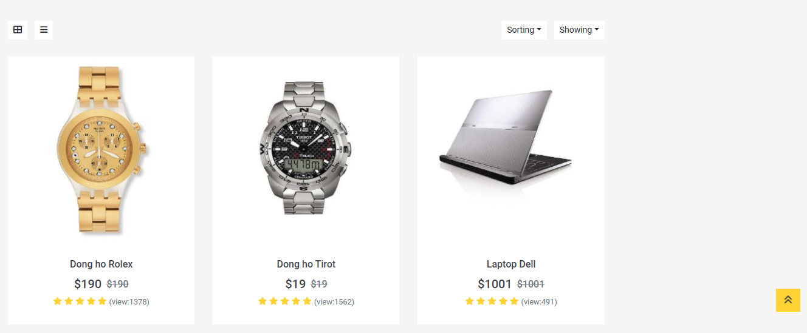

# 🛒 E-Commerce Backend API

This is a robust **Backend API** designed for an e-commerce platform, built using **ASP.NET Core 8.0**. The API provides full support for managing products, users, and orders, enabling a seamless e-commerce experience. It includes various advanced features such as:

- **Product Management**: Perform CRUD (Create, Read, Update, Delete) operations on product data, including product names, descriptions, prices, and inventory.
- **Order Management**: Handle customer orders, track statuses, and integrate with payment gateways.
- **User Authentication**: Basic user management with registration and login functionality.
- **Machine Learning Integration**: Product recommendation using **TF-IDF** (Term Frequency-Inverse Document Frequency) and **Cosine Similarity**, which helps suggest similar products to customers.
- **Payment Gateway**: Integration with **VnPay**, a popular Vietnamese payment service provider, for secure online transactions.

This API is built for high performance and scalability, featuring caching via Redis, full-text search with **Elasticsearch**, and efficient data processing strategies to handle large-scale e-commerce environments.

---
## 📑 Table of Contents

1. [🚀 Technologies Used](#-technologies-used)
2. [📌 Key Features](#-key-features)
3. [🧠 Machine Learning (Product Recommendations)](#-machine-learning-product-recommendations)
4. [🔧 Installation & Running the Project](#-installation--running-the-project)

## 🚀 Technologies Used

| Technology                           | Specific Purpose in the Project                                                                 |
|---------------------------------------|------------------------------------------------------------------------------------------------|
| **ASP.NET Core 8.0**                  | Core framework for building the backend and RESTful API                                           |
| **Entity Framework Core (EF Core)**   | ORM for interacting with the SQL Server database to manage products, orders, and users          |
| **Microsoft.ML, MathNet.Numerics**    | Implementing TF-IDF to convert product names into vectors and using Cosine Similarity for product recommendations |
| **Bogus**                             | Generating sample data for products, users, and orders for development and testing purposes      |
| **Swashbuckle.AspNetCore (Swagger)**  | API documentation and testing interface for easy interaction with the API                       |
| **VnPay**                             | Integration with the VnPay payment gateway for generating payment URLs and handling transactions |

---

## 📌 Key Features

- ✅ **Product Management**: Create, update, delete, and retrieve products.
- ✅ **Order Management**: Handle order processing, shipping, and payment status.
- ✅ **User Authentication**: Basic user registration and login with JWT-based authentication.
- ✅ **Product Recommendations**: Using **TF-IDF** and **Cosine Similarity**, the API can suggest similar products to users based on the product name.
- ✅ **Swagger UI**: Fully interactive API documentation that makes testing the API straightforward.
- ✅ **Sample Data Generation**: Automatically generate product, user, and order data for development and testing purposes using the **Bogus** library.

---

## 🧠 Machine Learning (Product Recommendations)

This feature implements **TF-IDF** (Term Frequency-Inverse Document Frequency) to convert product names into vectors, which are then compared using **Cosine Similarity** to find the most similar products. This method improves the shopping experience by recommending products that are contextually related based on their names.

> Example: Searching for a product called "Red T-shirt" will return the top 5 most similar products, such as other types of t-shirts or similar apparel.

---

## 🔧 Installation & Running the Project

To run this project locally, follow the steps below:

### 1️⃣ Clone the repository
```bash
git clone https://github.com/your-username/e-commerce-backend.git
cd e-commerce-backend
```


<p align="center">
  
  

  <br>
  <em>Giao diện Đăng kí, Đăng nhập hệ thống</em>
  <br></br>
</p>

<p align="center">
  
  <br>
  <em> Giao diện trang chủ </em>
    <br></br>

</p>

<p align="center">
  
  <br>
  <em>Chi tiết sản phẩm</em>
    <br></br>
</p>

<p align="center">
    
  
  <br>
  <em>Danh sách danh mục và sản phẩm</em>
    <br></br>
</p>

<p align="center">
    
  <br>
  <em>Trang đặt hàng</em>
    <br></br>
</p>

<p align="center">
    
      
  <br>
  <em>Giao diện thanh toán VnPay</em>
    <br></br>
</p>

<p align="center">
    
      
        

  <br>
  <em>Giao diện quản lí của Admin</em>
    <br></br>
</p>

<p align="center">
    
      

  <br>
  <em>Swagger</em>
    <br></br>
</p>
